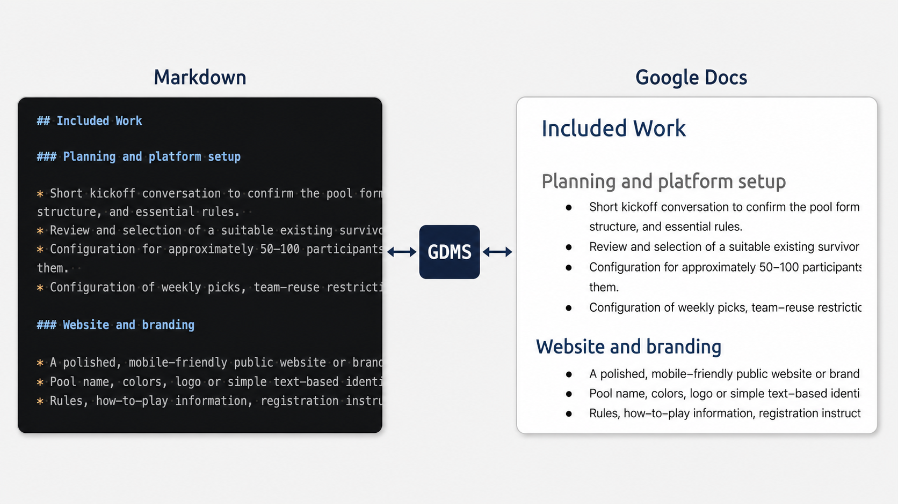
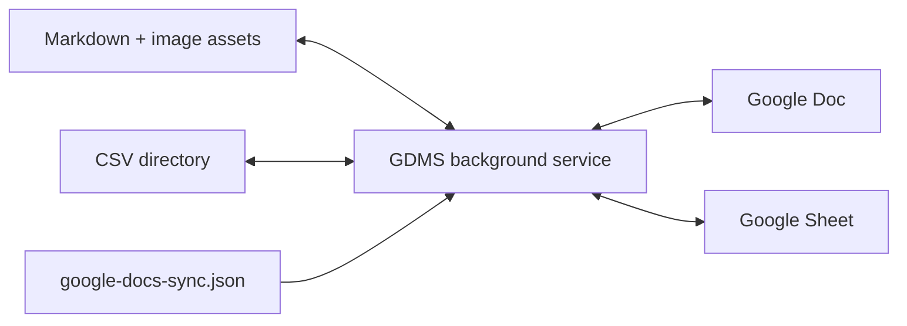

# GDMS — Google Docs/Sheets ↔ Markdown/CSV Sync

GDMS is a self-hosted macOS synchronization service that keeps selected Google
Docs paired with Markdown files and selected Google Sheets paired with CSV
directories in local workspaces.

```text
meeting-notes.md  ↔  Google Doc
budget/*.csv      ↔  Google Sheet (one CSV per tab)
```

It preserves the Google document as the rich collaboration surface while
making its supported content available as ordinary local files for Codex,
Git, editors, and other file-based tools. Only explicitly paired documents are
synchronized; repositories and unrelated files are never copied to Drive.



Current release: **0.8.0** · macOS · Node.js 22+ · [MIT licensed](LICENSE)

## What it does

- Synchronizes Google Docs and Markdown in both directions.
- Synchronizes Google Sheets and per-tab CSV files in both directions,
  including formulas.
- Synchronizes standalone PNG, JPEG, and GIF images through portable sibling
  asset directories.
- Preserves document IDs, URLs, and unchanged Google Docs ranges.
- Creates and pairs Docs from Markdown or Sheets from CSV through Finder Quick
  Actions.
- Pairs the active Doc or Sheet from Safari or a supported Chromium browser
  through an optional Raycast command.
- Runs automatically after login and can send an independent weekly health
  heartbeat.
- Shows human-readable sync status and links on both sides of each pairing.
- Can explicitly delete both sides of a Markdown/Google Docs pairing, or
  globally opt in to moving Docs to Drive trash after a missing-file grace period,
  with an email notification after the trash operation succeeds.

## Is it for me?

GDMS is currently best suited to a technically comfortable macOS user who
wants a small, self-hosted bridge between Google documents and local project
files. It runs from a source checkout; it is not yet a packaged Mac app or npm
CLI.

Before installing, expect to configure:

- Node.js 22 or newer;
- a Google Cloud OAuth desktop client with Drive, Docs, and Sheets APIs;
- Safari or a supported Chromium browser, plus Raycast, for the
  active-document shortcut workflow;
- Cloudflare R2 and the included Worker to push local images to Docs; and
- optionally, Resend for the weekly success email.

Raycast and a supported browser are not required when using only the CLI or Finder Quick
Actions. Remote images can still be pulled without R2, but local image
additions and replacements require it.

See [installation guide](docs/installation.md) for prerequisites, authorization, first pairing,
R2 configuration, and optional Finder and Raycast setup.

## Quick start

After completing the Google authorization steps in the [installation guide](docs/installation.md):

```sh
npm install
npm link
gdms auth
gdms install-service
gdms install-finder-action
```

Then choose one starting point:

- Bring a Google Doc or Sheet to the front in Safari, Chrome, Chromium, Brave,
  or Microsoft Edge and run **Pair Google Doc or Sheet with GDMS** from
  Raycast.
- Control-click local Markdown files in Finder and use **Sync MDs with New
  Google Docs (GDMS)**, or select CSV files and use **Combine & Sync CSVs with
  New Google Sheet (GDMS)**.
- Pair or create a document directly with the commands in
  [installation guide](docs/installation.md#pair-your-first-document).

Once paired, local changes are watched immediately and Google changes are
polled automatically. Moving a paired Markdown file within its workspace or
renaming its Google Doc updates the portable pairing metadata.

## How synchronization works



Each workspace tracks a visible `google-docs-sync.json` containing portable
relative paths and Google document IDs. Machine-specific hashes, revisions,
timestamps, and credentials remain outside Git under:

```text
~/Library/Application Support/google-docs-markdown-sync/
```

OAuth and R2 credentials are stored in the macOS Keychain. The service watches
Markdown, referenced image assets, and CSV directories locally; it polls paired
Google Docs and Sheets every five seconds. Synchronization passes are
single-flight, and failed remote requests use bounded exponential backoff.

For the manifest format, see the [installation guide](docs/installation.md#pairing-manifest). For
detailed synchronization semantics, service management, logs, heartbeat
configuration, and troubleshooting, see the [operations guide](docs/operations.md).
The consolidated [command reference](docs/operations.md#command-reference) lists
every `gdms` command, its arguments, and what it can modify.
For the user-visible mapping from Markdown blank lines, headings, paragraphs,
and lists to Google Docs formatting, see the [formatting guide](docs/formatting.md).
For common questions about sharing and synchronization, see the
[FAQ](docs/faq.md).

## Supported content and important limits

Google Docs' native Markdown export normally defines the supported Docs →
Markdown subset. When Drive's export-size limit rejects a large document, GDMS
falls back to serializing that subset through the Google Docs API. Headings,
paragraphs, ordered and unordered lists, links, bold, italics, simple tables,
blank-line spacing, heading links, and standalone images round-trip.
Incremental pushes preserve unchanged document ranges and native tables of
contents where the APIs allow it.

Google Sheets pairings use one local directory per spreadsheet and one CSV per
tab. Raw values and formulas round-trip. Formatting, charts, comments, filters,
notes, validation, and protected ranges remain in Sheets and are not
represented locally.

Important current limitations:

- Mixed text-and-image paragraphs cannot be changed from Markdown; GDMS fails
  safely instead of risking image loss.
- A changed table structure may require a full Docs body rebuild. A rebuild is
  refused if the document contains images.
- Comments and suggestions are not represented in Markdown. Anchors inside a
  replaced range can be affected.
- General simultaneous text edits use the later modification timestamp. If an
  image-bearing document changed on both sides, synchronization stops with an
  explicit conflict.
- Floating images, drawings, linked charts, cropping, rotation, and other
  advanced visual effects are unsupported.
- Deleting a generated status artifact does not unpair a document; it is
  recreated on a later sync pass.
- Recover an accidentally trashed and unpaired Doc with `gdms recover`; GDMS
  preserves local Markdown/assets, restores the same Drive ID, re-pairs it at
  the requested path, and verifies the result. See the
  [recovery runbook](docs/operations.md#recover-an-accidentally-trashed-pairing).
- Deletion propagation currently applies only to Markdown/Google Docs
  pairings. Missing CSV directories do not trash paired Google Sheets.

The complete image model, safety rules, and remaining hardening work are in
[image synchronization design](docs/design/image-sync.md). Planned conflict,
pairing-control, fidelity, and managed-folder work is in the
[roadmap](docs/roadmap.md). The exploratory
[managed folder synchronization design](docs/design/managed-folder-sync.md)
records the proposed scope and unresolved safety decisions; it describes a
potential future feature, not current behavior.

## Project layout

- `src/`: synchronization service, Google APIs, CLI, installers, status, image
  staging, and heartbeat.
- `raycast-extension/`: optional active-browser document pairing command.
- `cloudflare/image-gateway-worker.js`: authenticated private-R2 fetch gateway.
- `test/`: Node unit tests for Docs, Sheets, images, manifests, and operations.
- [Installation](docs/installation.md): setup and first-use guide.
- [Operations](docs/operations.md): service operation and troubleshooting.
- [Formatting](docs/formatting.md): Markdown-to-Google-Docs formatting behavior.
- [FAQ](docs/faq.md): common questions about sharing and synchronization.
- [CONTRIBUTING.md](CONTRIBUTING.md): development and validation workflow.
- [CHANGELOG.md](CHANGELOG.md): release history.
- [Roadmap](docs/roadmap.md): product and engineering direction.

## Development

```sh
npm install
npm run check
```

The complete check validates JavaScript, runs the Node tests, and type-checks
the Raycast extension. See [CONTRIBUTING.md](CONTRIBUTING.md) before changing
synchronization behavior.

## License

Licensed under the [MIT License](LICENSE).
